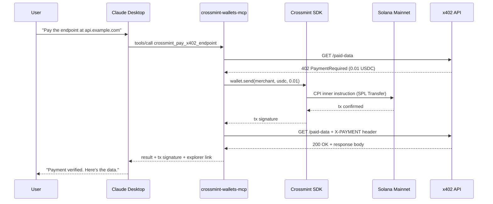
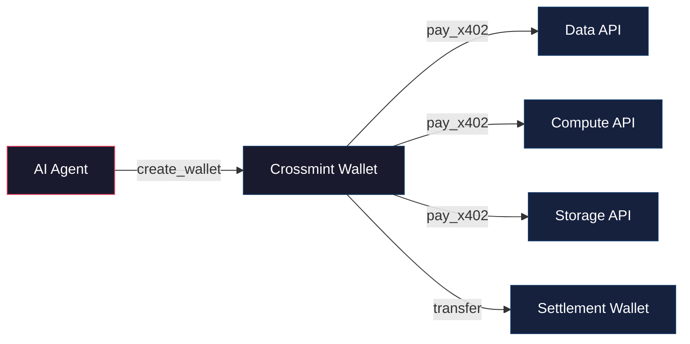
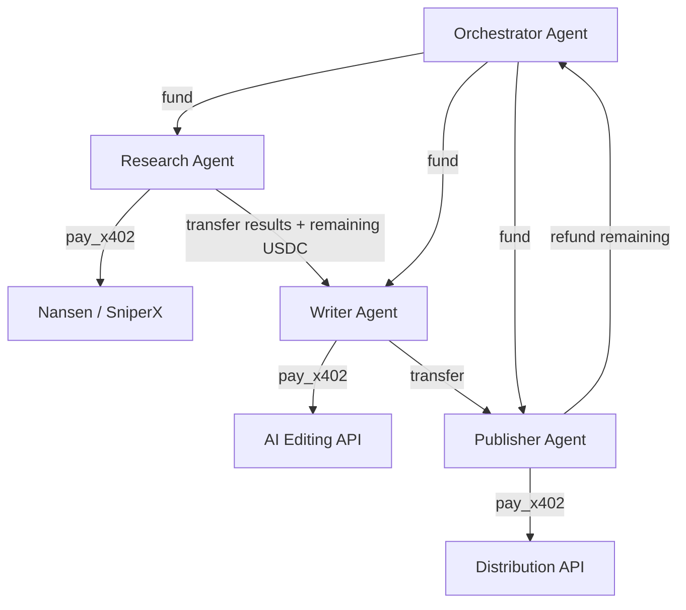
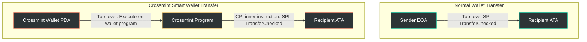

# crossmint-wallets-mcp

> An MCP server that exposes Crossmint smart wallet primitives as tools for
> any MCP-native client: Claude Desktop, Continue.dev, Cline, Codex CLI,
> and anything else that speaks the Model Context Protocol.

**Status:** v0.2.3 — Solana mainnet verified end-to-end in Claude Desktop. Base EVM planned.

## What this gives you

Four tools, callable from any MCP client, each wrapping a primitive from
[`@crossmint/wallets-sdk`](https://www.npmjs.com/package/@crossmint/wallets-sdk):

| Tool                              | What it does                                                        |
|-----------------------------------|---------------------------------------------------------------------|
| `crossmint_create_wallet`         | Create a new Crossmint smart wallet on the given chain              |
| `crossmint_get_balance`           | Read native token + USDC + optional extra balances for a wallet     |
| `crossmint_transfer_token`        | Send USDC (or any supported token) from a Crossmint wallet          |
| `crossmint_pay_x402_endpoint`     | Fetch an HTTP URL, handle its x402 payment challenge, return the paid response |

The killer tool is `crossmint_pay_x402_endpoint`. One call, any URL, any
MCP client. The agent handles the 402 parse, the wallet signing, the
on-chain confirmation, and the retry automatically.

## How it works



## Verified on Solana mainnet

All four tools tested end-to-end in Claude Desktop on April 10, 2026:

| Step | Tool | Result |
|------|------|--------|
| Create wallet with alias `demo-4` | `crossmint_create_wallet` | `EPgNi56nv48KcKNZDadhhnQQwMT3nsUsr27bBb6h6R5D` |
| Check balances of 3 wallets | `crossmint_get_balance` (x3) | Table with SOL + USDC per wallet |
| Transfer 0.05 USDC payer → demo-4 | `crossmint_transfer_token` | Confirmed on-chain |
| Pay x402 paywall from demo-4 | `crossmint_pay_x402_endpoint` | HTTP 200 — "Payment verified" |

First mainnet tx: [`KRjW2uK7LBioyyy1P3xcJTkpS2ibpCjBq1Ektnf4icL6GH25VnesoCGdQN7DbWYbbyjv9MxHoFrS3hsx7ZgkbEg`](https://explorer.solana.com/tx/KRjW2uK7LBioyyy1P3xcJTkpS2ibpCjBq1Ektnf4icL6GH25VnesoCGdQN7DbWYbbyjv9MxHoFrS3hsx7ZgkbEg)

## Use cases

### Autonomous agent commerce



An AI agent can create its own wallet, receive a USDC budget, and then autonomously pay for services it needs — data feeds, compute, storage, other APIs — without human intervention for each transaction. The `maxUsdcAtomic` guardrail prevents runaway spending.

### Multi-agent payment mesh



An orchestrator agent funds sub-agents with purpose-specific wallets. Each agent spends on the APIs it needs, passes results + remaining budget to the next agent, and the last one refunds the orchestrator. All on-chain, all auditable.

### Pay-per-query data access

Any API can become an x402 paywall. Instead of managing API keys, rate limits, and subscription tiers:

1. Server returns HTTP 402 with price
2. Agent pays on-chain
3. Server returns data
4. No accounts, no API keys, no subscriptions

Works today with any x402-compatible server. Tested with [SniperX](https://x402.sniperx.fun) (crypto analytics, $0.03/query) and local paywalls.

### Streaming-safe treasury management

Wallets can be created with aliases, making them deterministic. An agent managing funds on a livestream can:

- Create named wallets (`treasury`, `petty-cash`, `donations`)
- Check balances across all wallets in one prompt
- Transfer between wallets with natural language
- Pay x402 endpoints with spend caps
- All without exposing private keys on screen (Crossmint handles signing server-side)

## Why this exists

[lobster.cash](https://lobster.cash) is Crossmint's payment engine for AI
agents. It ships as a CLI (`@crossmint/lobster-cli`) that installs into
Claude Code, Cursor, and OpenClaw via the skills architecture. But a lot
of 2026's agent surface speaks MCP, not skills:

- **Claude Desktop** (Anthropic's desktop app)
- **Continue.dev** (IDE assistant)
- **Cline** (VS Code agent extension)
- **Codex CLI** (OpenAI's command-line agent)
- And everything else that has shipped against the MCP spec

`crossmint-wallets-mcp` is the MCP-native companion to lobster.cash —
same wallets, same payments, same chain, different transport. It is not
a replacement. It is the piece lobster.cash doesn't ship.

## Install

```bash
# Global install
npm install -g crossmint-wallets-mcp

# Or one-off via npx (recommended for MCP clients)
npx crossmint-wallets-mcp
```

Node.js >= 20 required.

## Configure

You need a **Crossmint server API key** with the following scopes:

- `wallets.create`
- `wallets.read`
- `wallets:transactions.create`
- `wallets:transactions.sign`
- `wallets:balance.read`

Create one at [crossmint.com/console](https://www.crossmint.com/console).

You also need a **server recovery signer secret** — any random 32+ char
string. Generate one with:

```bash
node -e "console.log(require('crypto').randomBytes(32).toString('hex'))"
```

This secret is what lets the server recover wallets if the wallet was
created with a `type: "server"` recovery config. Keep it safe; losing it
means losing access to wallets created under it.

Copy `.env.example` to `.env` and fill in the values, OR use the
file-reference pattern if you want secrets to live outside the project
tree (useful for Docker secrets, Kubernetes secrets, or streaming
safety):

```bash
# Either inline:
CROSSMINT_API_KEY=sk_prod_...
CROSSMINT_RECOVERY_SECRET=...

# Or by reference:
CROSSMINT_API_KEY_FILE=/run/secrets/crossmint-api-key
CROSSMINT_RECOVERY_SECRET_FILE=/run/secrets/crossmint-recovery-secret

# Plus:
DEFAULT_CHAIN=solana
SOLANA_RPC_URL=https://api.mainnet-beta.solana.com
```

## Hook it up to Claude Desktop

Edit `%APPDATA%\Claude\claude_desktop_config.json` on Windows, or
`~/Library/Application Support/Claude/claude_desktop_config.json` on
macOS, and add:

```json
{
  "mcpServers": {
    "crossmint-wallets": {
      "command": "npx",
      "args": ["-y", "crossmint-wallets-mcp"],
      "env": {
        "CROSSMINT_API_KEY": "sk_prod_your_key_here",
        "CROSSMINT_RECOVERY_SECRET": "your_random_hex_here",
        "DEFAULT_CHAIN": "solana"
      }
    }
  }
}
```

Restart Claude Desktop. You should see the MCP indicator appear in the
chat input. Try asking Claude:

> *Create a Crossmint smart wallet on Solana with alias "my-demo".*

Claude will call `crossmint_create_wallet` and return the wallet
address plus a Solana explorer link. You can then ask:

> *Pay the x402 endpoint at http://my.example.com/paid-data from that
> wallet, max 0.1 USDC.*

Claude will call `crossmint_pay_x402_endpoint`, move the USDC on-chain,
and return the paid response.

## Hook it up to other MCP clients

### Continue.dev

In your `~/.continue/config.json`:

```json
{
  "experimental": {
    "modelContextProtocolServers": [
      {
        "transport": {
          "type": "stdio",
          "command": "npx",
          "args": ["-y", "crossmint-wallets-mcp"],
          "env": {
            "CROSSMINT_API_KEY": "sk_prod_...",
            "CROSSMINT_RECOVERY_SECRET": "...",
            "DEFAULT_CHAIN": "solana"
          }
        }
      }
    ]
  }
}
```

### Cline

In the Cline MCP settings panel (gear icon > MCP Servers), add:

- **Name:** `crossmint-wallets`
- **Command:** `npx`
- **Args:** `-y crossmint-wallets-mcp`
- **Env:** same three vars as above

### Codex CLI

In `~/.codex/config.toml`:

```toml
[mcp_servers.crossmint-wallets]
command = "npx"
args = ["-y", "crossmint-wallets-mcp"]

[mcp_servers.crossmint-wallets.env]
CROSSMINT_API_KEY = "sk_prod_..."
CROSSMINT_RECOVERY_SECRET = "..."
DEFAULT_CHAIN = "solana"
```

## x402 protocol compatibility

The `crossmint_pay_x402_endpoint` tool supports both versions of the x402 protocol:

| Feature | Supported |
|---------|-----------|
| x402 v1 (payment requirements in JSON body) | Yes |
| x402 v2 (payment requirements in base64 `payment-required` header) | Yes (v0.2.0+) |
| `amount` field (standard) | Yes |
| `maxAmountRequired` field (SniperX, others) | Yes (v0.2.3+) |
| Multi-network 402 responses (e.g. Base + Solana) | Yes — prefers caller's chain (v0.2.2+) |
| `maxUsdcAtomic` spend cap | Yes |
| POST/PUT/PATCH with JSON body | Yes |

Tested against:
- Local x402 paywalls (hand-rolled, v1)
- [Nansen API](https://api.nansen.ai) (v2, Base + Solana)
- [SniperX](https://x402.sniperx.fun) (v1, Solana, `maxAmountRequired`)

## Demo

The repo includes a standalone smoke test that exercises every tool
against Solana mainnet with real USDC. It:

1. Creates (or loads from cache) a Crossmint smart wallet
2. Reads its balances
3. Boots a local x402 paywall server (`demo/paywall-server.ts`)
4. Calls the paywall, handles the 402, signs + sends the payment via the
   Crossmint wallet, retries with the `X-PAYMENT` header
5. Re-reads merchant balances to confirm the transfer landed

Run it:

```bash
pnpm install
pnpm tsx demo/create-merchant-wallet.ts  # one-time: create a merchant wallet
pnpm demo
```

Expected output (abbreviated):

```
=== WALLET READY ===
chain:    solana
address:  4xHkMCaKVBGw4GtdpeKoNZhGFDMi1tMCJDvXvxUmL8hM
====================

=== PAYER BALANCES ===
  usdc     1.807663 (decimals=6)
======================

[paywall] listening on http://localhost:4021/paid-data
[payX402Endpoint] paying 0.01 usdc to Fxr4...yqo on solana...
[payX402Endpoint] tx confirmed: 2tfihoFhFHKuexSA7FLAa6jAjNj22kmvpse42Vr6AAWmF1zxzsGVWQEVPabbmLMvhsGek8ukzWcrg6DngZgE4fxB
[paywall] 200 — payment verified

=== smoke test OK ===
```

## The Solana CPI nuance (and the companion skill)



Crossmint smart wallets on Solana are program-derived addresses (PDAs),
which means you **cannot** hand-roll a plain SPL token transfer to move
USDC out of one. The wallet PDA has no private key — only the Crossmint
wallet program can sign for it, via a cross-program invocation (CPI)
that wraps the SPL transfer as an inner instruction.

**Why this matters for x402:** Naive facilitators that only scan top-level
instructions see an opaque "smart wallet program" call and miss the USDC
transfer entirely — rejecting a valid payment. Facilitators that scan CPI
inner instructions (or verify via `postTokenBalances`) see the nested
transfer and verify it correctly.

The companion repo
[`crossmint-cpi-skill`](https://github.com/0xultravioleta/crossmint-cpi-skill)
is a lobster.cash-compatible skill that teaches AI agents this nuance in
detail, including a working recipe, common errors, and guidance for
x402 facilitator authors who need to verify Crossmint payments via
inner-instruction parsing.

## Fees

Crossmint charges a small service fee (approximately 0.001 USDC per
`wallet.send` operation) for the gasless relayer — Crossmint pays the
Solana network fee for the transaction, and recovers the cost from the
payer wallet. Budget for this when setting `maxUsdcAtomic` guardrails on
`crossmint_pay_x402_endpoint`.

## Environment variables

| Variable                          | Required | Default                                      | Description                                             |
|-----------------------------------|----------|----------------------------------------------|---------------------------------------------------------|
| `CROSSMINT_API_KEY`               | yes*     | ---                                          | Crossmint server API key                                |
| `CROSSMINT_API_KEY_FILE`          | yes*     | ---                                          | Path to file containing the API key (alternative)      |
| `CROSSMINT_RECOVERY_SECRET`       | yes*     | ---                                          | Server recovery signer (32+ char hex string)           |
| `CROSSMINT_RECOVERY_SECRET_FILE`  | yes*     | ---                                          | Path to file containing the recovery secret            |
| `DEFAULT_CHAIN`                   | no       | `solana`                                     | `solana`, `base`, or `base-sepolia`                     |
| `SOLANA_RPC_URL`                  | no       | `https://api.mainnet-beta.solana.com`        | Solana RPC endpoint (override for private RPCs)        |

\* Exactly one of `CROSSMINT_API_KEY` or `CROSSMINT_API_KEY_FILE` is
required. Same for the recovery secret.

## Changelog

| Version | Changes |
|---------|---------|
| 0.2.3 | Accept `maxAmountRequired` field (SniperX compatibility) |
| 0.2.2 | Chain preference: pick caller's chain when 402 offers multiple networks |
| 0.2.1 | CJS entry wrapper: intercept `process.stdout.write` before ESM loads, filter SDK telemetry from MCP transport |
| 0.2.0 | x402 v2: parse `payment-required` header (Nansen compatibility) |
| 0.1.1 | postinstall shim for broken `text-encoding-utf-8@1.0.2` (borsh/solana dep) |
| 0.1.0 | Initial release: 4 tools, Solana mainnet verified |

## License

MIT — so Crossmint can fork this repo into the `@crossmint` organization
with zero friction if they want to ship it as an official package.

## Acknowledgements

- [Crossmint](https://www.crossmint.com) for shipping the smart wallets
  and the `@crossmint/wallets-sdk` that makes this possible
- [lobster.cash](https://lobster.cash) for the skill architecture and
  the CLI that this MCP server is designed to complement
- [Faremeter](https://github.com/faremeter) for the x402 facilitator
  pattern that correctly handles CPI inner-instruction verification
- [The x402 protocol](https://x402.org) and the
  `@x402/core` + `@x402/svm` reference implementation
- [The Model Context Protocol team](https://modelcontextprotocol.io)
  for the spec and the TypeScript SDK

## Companion artifact

- [`crossmint-cpi-skill`](https://github.com/0xultravioleta/crossmint-cpi-skill) —
  the lobster.cash skill that teaches the Solana CPI inner-instruction
  nuance this MCP server is built around
