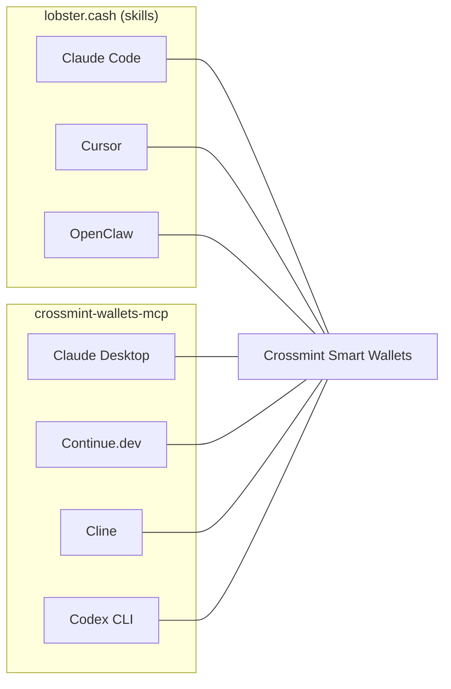
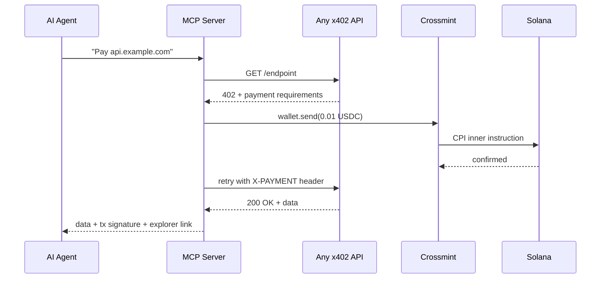
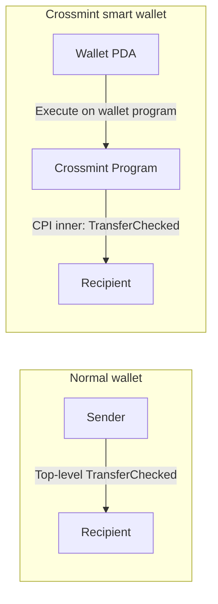

# crossmint-wallets-mcp

Crossmint smart wallets as MCP tools. Create wallets, check balances, transfer tokens, and pay x402 endpoints — from Claude Desktop, Continue.dev, Cline, or any MCP client.

**Verified on Solana mainnet with real USDC.** [See the transaction.](https://explorer.solana.com/tx/KRjW2uK7LBioyyy1P3xcJTkpS2ibpCjBq1Ektnf4icL6GH25VnesoCGdQN7DbWYbbyjv9MxHoFrS3hsx7ZgkbEg)

## One config block. Four tools.

Paste this into your Claude Desktop config. Restart. Done.

```json
{
  "mcpServers": {
    "crossmint-wallets": {
      "command": "npx",
      "args": ["-y", "crossmint-wallets-mcp"],
      "env": {
        "CROSSMINT_API_KEY": "sk_prod_...",
        "CROSSMINT_RECOVERY_SECRET": "...",
        "DEFAULT_CHAIN": "solana"
      }
    }
  }
}
```

Your agent now has:

| Tool | What it does |
|------|-------------|
| `crossmint_create_wallet` | Create a smart wallet on Solana or Base. Alias makes it deterministic. |
| `crossmint_get_balance` | Read SOL/ETH + USDC balances. No signer needed. |
| `crossmint_transfer_token` | Send tokens. Gasless — Crossmint pays the network fee. |
| `crossmint_pay_x402_endpoint` | **The one that matters.** Give it any URL. It handles the 402, pays USDC, retries, returns the data + tx signature. |

## What this means for Crossmint

Half the 2026 agent surface speaks MCP — Claude Desktop, Continue.dev, Cline, Codex CLI. [lobster.cash](https://lobster.cash) reaches the other half (Claude Code, Cursor, OpenClaw) via skills. This server is the missing bridge.



Ship both and every major AI agent can pay with Crossmint wallets. MIT licensed, ready to fork into `@crossmint` today.

## How a payment works



One tool call. Any x402 endpoint. Any MCP client. Real USDC on mainnet.

## The CPI nuance nobody documented

Crossmint smart wallets don't sign SPL transfers at the top level. The transfer happens inside a CPI — one level down.



Naive x402 facilitators miss the nested transfer and reject the payment. This is documented nowhere public — not in Crossmint docs, not in the [Solana Foundation x402 guide](https://solana.com/developers/guides/getstarted/intro-to-x402), not in any lobster.cash skill.

The companion [`crossmint-cpi-skill`](https://github.com/0xultravioleta/crossmint-cpi-skill) teaches agents this nuance and routes payments correctly.

## Tested on Solana mainnet

All four tools verified in Claude Desktop on April 10, 2026:

1. Created wallet with alias `demo-4` → `EPgNi56nv48KcKNZDadhhnQQwMT3nsUsr27bBb6h6R5D`
2. Checked balances across 3 wallets → table with SOL + USDC
3. Transferred 0.05 USDC between wallets → confirmed on-chain
4. Paid an x402 paywall → HTTP 402 → payment → HTTP 200 round trip

Multiple mainnet transactions verified on Solana Explorer.

## Run the demo yourself

```bash
git clone https://github.com/0xultravioleta/crossmint-wallets-mcp
cd crossmint-wallets-mcp
pnpm install
cp .env.example .env  # add your Crossmint API key + recovery secret
pnpm demo
```

The smoke test creates a wallet, checks balances, boots a local x402 paywall, pays it with real USDC, and verifies the merchant received the funds — all on Solana mainnet.

## What agents could do with this

**Pay-per-query data access** — Any API becomes an x402 paywall. No API keys, no subscriptions, no rate limit tiers. The agent pays per request with USDC.

**Autonomous commerce** — An agent creates its own wallet, receives a budget, and pays for services (data, compute, storage) without human approval for each transaction. `maxUsdcAtomic` prevents runaway spending.

**Multi-agent treasury** — An orchestrator funds sub-agents with purpose-specific wallets. Each agent spends on the APIs it needs and refunds the remainder. All on-chain, all auditable.

**Streaming-safe wallets** — Wallets with aliases are deterministic. No private keys to leak on screen. Crossmint handles signing server-side.

## Setup

You need a Crossmint server API key ([crossmint.com/console](https://www.crossmint.com/console)) with scopes: `wallets.create`, `wallets.read`, `wallets:transactions.create`, `wallets:transactions.sign`, `wallets:balance.read`.

Generate a recovery secret: `node -e "console.log(require('crypto').randomBytes(32).toString('hex'))"`

Set via environment variables or file references (for Docker/K8s secrets):

```bash
CROSSMINT_API_KEY=sk_prod_...          # or CROSSMINT_API_KEY_FILE=/run/secrets/...
CROSSMINT_RECOVERY_SECRET=...          # or CROSSMINT_RECOVERY_SECRET_FILE=/run/secrets/...
DEFAULT_CHAIN=solana
```

<details>
<summary>Other MCP clients (Continue.dev, Cline, Codex CLI)</summary>

### Continue.dev
```json
{
  "experimental": {
    "modelContextProtocolServers": [{
      "transport": {
        "type": "stdio",
        "command": "npx",
        "args": ["-y", "crossmint-wallets-mcp"],
        "env": {
          "CROSSMINT_API_KEY": "sk_prod_...",
          "CROSSMINT_RECOVERY_SECRET": "...",
          "DEFAULT_CHAIN": "solana"
        }
      }
    }]
  }
}
```

### Cline
MCP settings panel → Add server: command `npx`, args `-y crossmint-wallets-mcp`, same env vars.

### Codex CLI
```toml
[mcp_servers.crossmint-wallets]
command = "npx"
args = ["-y", "crossmint-wallets-mcp"]
[mcp_servers.crossmint-wallets.env]
CROSSMINT_API_KEY = "sk_prod_..."
CROSSMINT_RECOVERY_SECRET = "..."
DEFAULT_CHAIN = "solana"
```

</details>

## License

MIT — fork into `@crossmint` with zero friction.

## Links

- **MCP server:** [github.com/0xultravioleta/crossmint-wallets-mcp](https://github.com/0xultravioleta/crossmint-wallets-mcp)
- **CPI skill:** [github.com/0xultravioleta/crossmint-cpi-skill](https://github.com/0xultravioleta/crossmint-cpi-skill)
- **npm:** [crossmint-wallets-mcp](https://www.npmjs.com/package/crossmint-wallets-mcp)
- **Companion blog post:** [crossmint-devrel-challenge/content/blog-post.md](https://github.com/0xultravioleta/crossmint-devrel-challenge/blob/main/content/blog-post.md)
